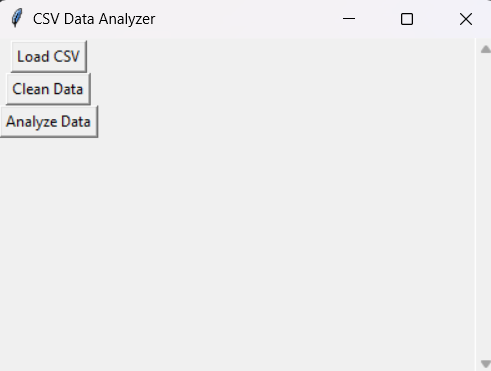
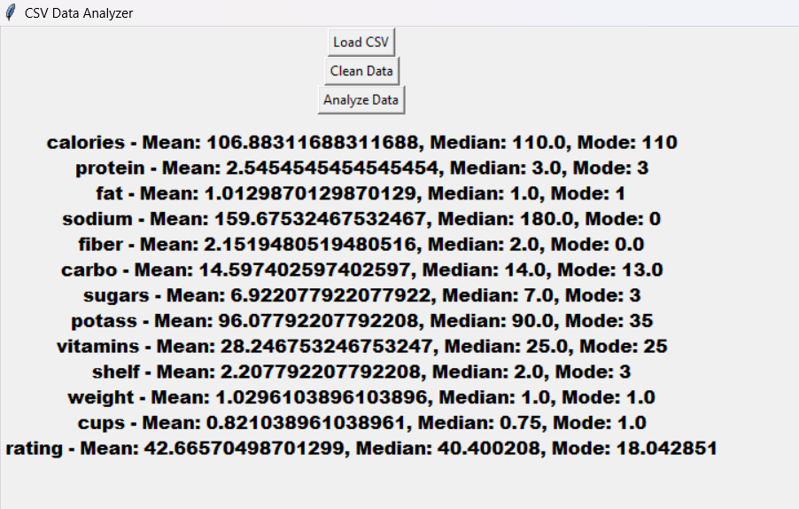
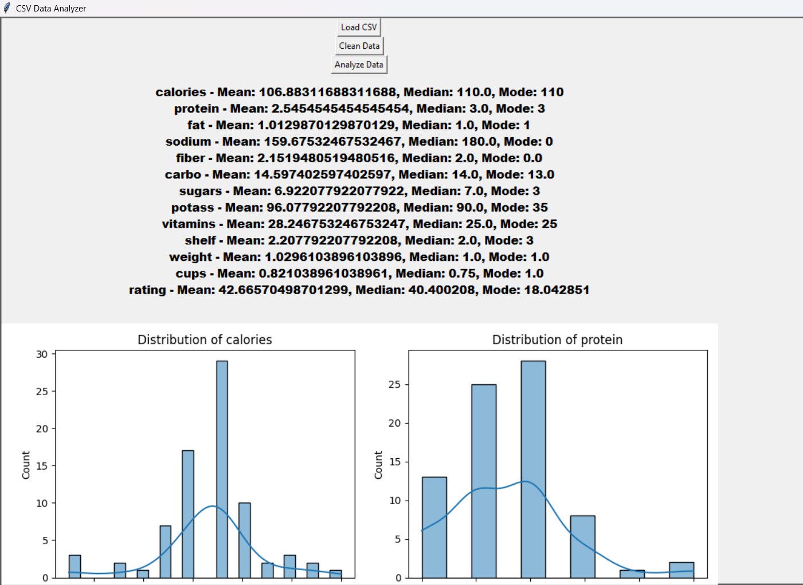
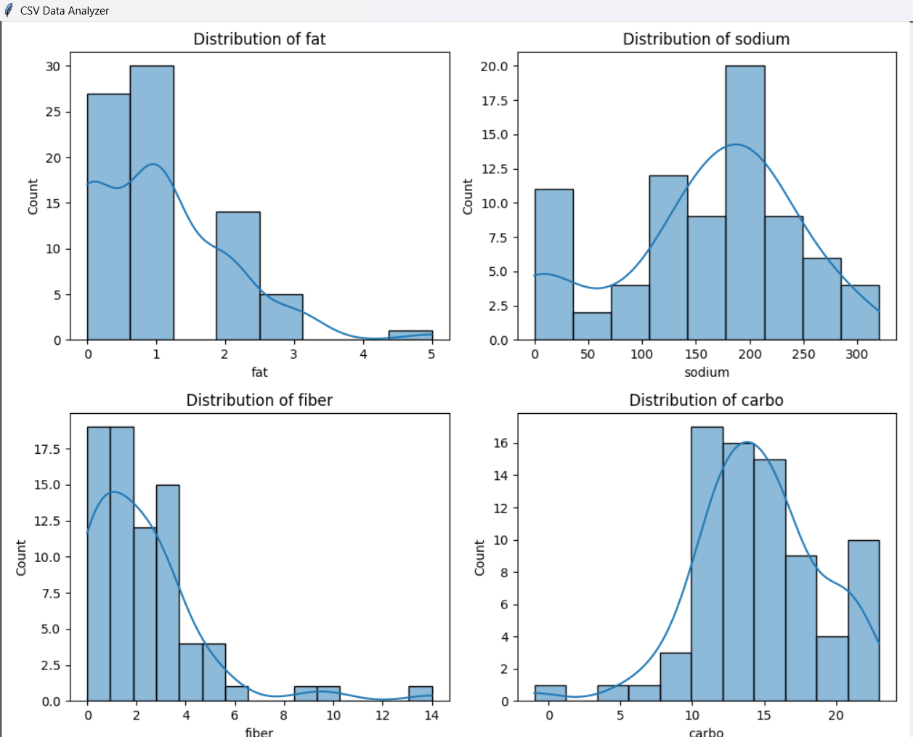
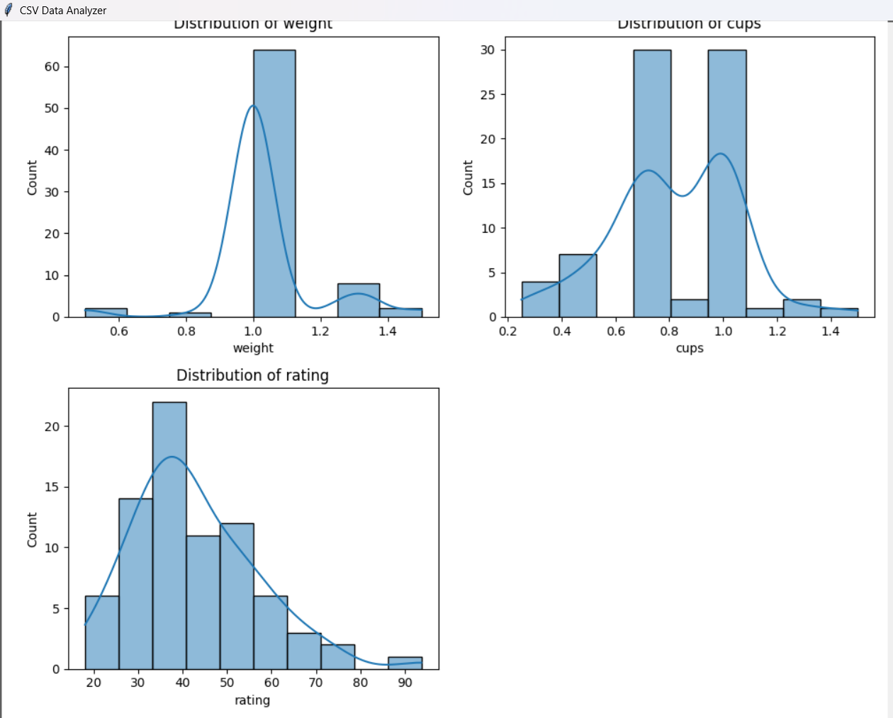
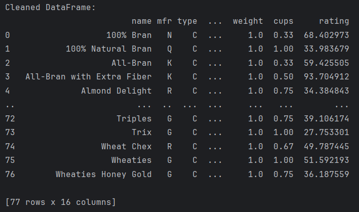

# CSV Data Analyzer
## Analyze Your CSV Data with Ease - User Manual

The CSV Data Analyzer tool allows you to load, clean, and visualize CSV data, providing insights and analysis through statistics and visualizations like histograms.

## Prerequisites

Before you begin, ensure that you have the following software and tools installed on your machine:

- **Python 3.x** - This project is developed using Python.
- **pip** - Python's package installer, required to install dependencies.
- **Code Editor** - Use any code editor like VS Code, PyCharm, Sublime Text, etc.
- **Matplotlib** - For data visualization.
- **Pandas** - For data manipulation.
- **Seaborn** - For enhanced visualization.

You can install the required dependencies by following the installation steps below.

## Features

The CSV Data Analyzer offers the following features:

- **Load CSV File**: Import CSV files into the application for analysis.
- **Clean Data**: Automatically handle missing data by filling NaN values and removing columns with excessive missing data.
- **Analyze Data**: Visualize numeric data distributions with histograms.
- **Display Statistics**: Automatically calculate and display mean, median, and mode for numeric columns.
- **Interactive Visualizations**: Embedded visualizations (like histograms) directly in the application window.
- **Cross-platform**: Works on all platforms (Windows, macOS, Linux).
- **Simple and intuitive GUI**: Built using Tkinter for a user-friendly experience.

## Installation Steps

Follow these steps to install and set up the CSV Data Analyzer:

1. **Step 1:** Clone or download the repository to your local machine.

    ```bash
    git clone https://github.com/Dhwani2k3/csv-data-analyzer.git
    ```

2. **Step 2:** Navigate to the project directory in the terminal.

    ```bash
    cd csv-data-analyzer
    ```

3. **Step 3:** Create a virtual environment (optional but recommended).

    ```bash
    python -m venv venv
    ```

4. **Step 4:** Activate the virtual environment.

    - On Linux/macOS:

    ```bash
    source venv/bin/activate
    ```

    - On Windows:

    ```bash
    venv\Scripts\activate
    ```

5. **Step 5:** Install the required dependencies using pip.

    ```bash
    pip install -r requirements.txt
    ```

## How to Use the CSV Data Analyzer

Once everything is set up, follow these steps to use the tool:

1. **Step 1:** Open a terminal window and run the Python script to start the application.

    ```bash
    python data_analyzer.py
    ```

2. **Step 2:** Click on the "Load CSV" button to open a file dialog. Select your CSV file for analysis.

3. **Step 3:** Once the CSV is loaded, the tool will automatically calculate and display statistics like the mean, median, and mode for numeric columns.

4. **Step 4:** Use the "Clean Data" button to fill missing values and remove columns with excessive NaN values.

5. **Step 5:** Click the "Analyze Data" button to visualize the distribution of numeric columns through histograms.

6. **Step 6:** To close the application, simply close the window.

## Screenshot of CSV Data Analyzer in Action

<div style="display: flex; justify-content: center; gap: 50px;">
    
    
</div>
<div style="display: flex; justify-content: center; gap: 50px;">
    
    
</div>
<div style="display: flex; justify-content: center; gap: 50px;">
    
    
</div>

## Troubleshooting

If you encounter any issues, here are some common solutions:

- **Problem:** "ModuleNotFoundError" or missing dependencies.  
  **Solution:** Make sure you have installed the necessary dependencies using `pip install -r requirements.txt`.

- **Problem:** "No numeric columns available for analysis" error.  
  **Solution:** Ensure that your CSV file contains numeric data. If not, try uploading a different file with numeric values.

- **Problem:** "Please load a CSV file first" error.  
  **Solution:** Ensure that you have loaded a CSV file using the "Load CSV" button before analyzing or cleaning the data.

- **Problem:** The application is crashing or not opening.  
  **Solution:** Check if your Python version is up to date, and make sure all prerequisites are installed correctly.

## Contact Support

If you need additional help, feel free to contact us:

- **Email:** [support@csvdataanalyzer.com](mailto:support@csvdataanalyzer.com)
- **GitHub Repository:** [https://github.com/Dhwani2k3/csv-data-analyzer](https://github.com/Dhwani2k3/csv-data-analyzer)

We will be happy to assist you with any questions or issues you may have!

---

&copy; 2024 CSV Data Analyzer | All Rights Reserved
